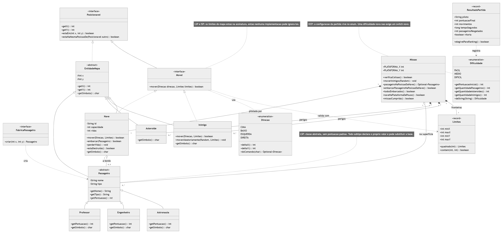
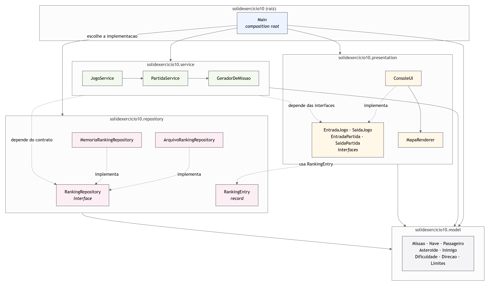

# Missão Marte Unifor: refatoração SOLID

**Aluno:** Arthur Pinheiro
**Disciplina:** Projeto e Arquitetura de Sistemas (Unifor)
**Atividade:** Trabalho 2, refatoração do Exercício 10 aplicando SOLID

Este repositório traz as duas versões do jogo lado a lado: o código inicial preservado
e a versão reorganizada em camadas. O objetivo não é mudar o que o jogo faz, e sim
mudar quem é responsável por cada coisa.

| | Código inicial | Versão refatorada |
| --- | --- | --- |
| Pasta | `src/exercicio10` | `src/solidexercicio10` |
| Classe de entrada | `exercicio10.Main` | `solidexercicio10.Main` |
| Linhas na `Main` | 557 (472 efetivas) | 60 (21 efetivas) |
| Arquivos | 10 | 30 |
| Testes automatizados | nenhum | 159 verificações |

---

## Como compilar

Requer **JDK 17 ou superior** (testado no JDK 25). Não há Maven nem Gradle: é
`javac` puro, rodando na raiz do repositório.

### No Windows (PowerShell)

Versão refatorada:

```powershell
javac -encoding UTF-8 -d out-solid (Get-ChildItem -Recurse src\solidexercicio10\*.java | % FullName)
```

Código inicial, para comparação:

```powershell
javac -encoding UTF-8 -d out src\exercicio10\*.java
```

### No bash (Git Bash, Linux ou macOS)

```bash
javac -encoding UTF-8 -d out-solid $(find src/solidexercicio10 -name "*.java")
```

```bash
javac -encoding UTF-8 -d out src/exercicio10/*.java
```

> O comando com `find` **não funciona no PowerShell**, porque `find` ali é outro
> programa e `$( )` não é substituição de comando. Use o bloco do PowerShell acima.

## Como executar

**Versão refatorada:**

```bash
java -cp out-solid solidexercicio10.Main
```

**Código inicial:**

```bash
java -cp out exercicio10.Main
```

As duas gravam o ranking em arquivos **separados** (`ranking-solid-exercicio10.json` e
`ranking.json`), de propósito, para que rodar uma não interfira na outra durante a
comparação.

### Acentos no Windows

O jogo imprime texto com acento. No Windows, a JVM escreve no console usando a página
de código do sistema (`Cp1252` por padrão), e não UTF-8, mesmo com `-Dfile.encoding`.
Se os acentos saírem errados, o console e a JVM estão em codificações diferentes.

A linha abaixo alinha as duas em UTF-8 e roda o jogo. **Testada no Windows 11 com
PowerShell 5.1 e JDK 25:**

```powershell
chcp 65001; [Console]::OutputEncoding = [System.Text.Encoding]::UTF8; java "-Dstdout.encoding=UTF-8" -cp out-solid solidexercicio10.Main
```

Duas armadilhas nessa linha:

- as **aspas** em volta de `-Dstdout.encoding=UTF-8` são obrigatórias no PowerShell.
  Sem elas o parser quebra o argumento no ponto e o `java` nem inicia;
- o `chcp` sozinho não basta, porque ele muda só quem lê. A flag muda quem escreve.

Se preferir o caminho inverso, alinhando as duas pontas em `Cp1252` em vez de UTF-8,
funciona igual e sem flag nenhuma:

```powershell
chcp 1252; java -cp out-solid solidexercicio10.Main
```

O mesmo vale para o jogo original e para os testes. É configuração de terminal, não do
código: o jogo original se comporta exatamente igual.

Comandos dentro da partida: `w` `a` `s` `d` para mover, `c` para embarcar o passageiro
que estiver sob a nave, `q` para abortar. A missão só termina quando todos os
passageiros estiverem a bordo **e** a nave voltar à plataforma `L` em (0,0).

## Como rodar os testes

Compile os testes, depois de já ter compilado a versão refatorada:

```powershell
javac -encoding UTF-8 -cp out-solid -d out-test test\*.java
```

### No Windows (PowerShell)

```powershell
java -cp "out-solid;out-test" TestesMissaoMarte
```

```powershell
java -cp "out-solid;out-test" TesteIntegracaoConsole
```

```powershell
powershell -ExecutionPolicy Bypass -File test\teste-funcional.ps1
```

### No Linux ou macOS

O separador do classpath é `:` em vez de `;`.

```bash
java -cp "out-solid:out-test" TestesMissaoMarte
```

```bash
java -cp "out-solid:out-test" TesteIntegracaoConsole
```

```bash
bash test/teste-funcional.sh
```

> No **Git Bash rodando no Windows** o separador continua sendo `;`, porque quem lê o
> classpath é a JVM do Windows, não o shell. Use as linhas do bloco do PowerShell,
> trocando só o `powershell -File ...` por `bash test/teste-funcional.sh`.

O teste funcional tem duas versões com os mesmos 68 cenários. O `.ps1` existe para
não depender de bash no Windows. Os três terminam com código de saída 1 se alguma
verificação falhar. A saída completa das três está em
[`docs/evidencia-testes.md`](docs/evidencia-testes.md).

- `TestesMissaoMarte`: **74 verificações**. Cobre pontuação por tipo de passageiro,
  capacidade da nave, limites de movimento, colisão, embarque, renderização do mapa,
  as duas implementações de ranking e uma **partida inteira até a vitória**, jogada
  por um piloto automático, sem console e sem disco.
- `TesteIntegracaoConsole`: **17 verificações**. Monta o jogo exatamente como o
  `Main` faz (`ConsoleUI` de verdade, arquivo de verdade) e percorre menu, partida,
  vitória, estatísticas, ranking e saída, conferindo o JSON gravado em disco.
- `teste-funcional`: **68 cenários**. Executa o jogo pelo console com entrada
  roteirizada e confere a saída: menu e opções inválidas, ranking vazio e com dados,
  corte no Top 5, reset confirmado e cancelado, as três dificuldades com e sem acento,
  tamanhos de mapa inválidos, o ajuste de mapa pequeno demais, o desenho do mapa e a
  legenda, todos os comandos da partida, o bloqueio na borda, o encerramento por
  pontuação zerada e a robustez do arquivo de ranking.

Somando as três: **159 verificações, 0 falhas**.

---

## Estrutura da versão refatorada

```text
src/solidexercicio10/
  Main.java                    raiz de composição: monta o grafo e dispara o jogo
  model/                       entidades e regras do domínio
    Posicionavel.java            interface: quem ocupa uma coordenada
    Movel.java                   interface: quem se desloca respeitando os limites
    FabricaPassageiro.java       interface: cria um passageiro em uma posição
    EntidadeMapa.java            abstrata: coordenada + símbolo no mapa
    Passageiro.java              abstrata: nome, tipo e pontuação
    Professor / Engenheiro / Astronauta.java
    Asteroide.java / Inimigo.java / Nave.java
    Missao.java                  estado da partida
    Dificuldade.java             enum com a configuração de cada dificuldade
    Direcao.java                 enum das teclas de movimento
    Limites.java                 record das fronteiras do mapa
    ResultadoPartida.java        record do resultado de uma missão
  service/                     fluxo e regras
    JogoService.java             menu e regra de entrada no ranking
    PartidaService.java          uma partida, do briefing ao encerramento
    GeradorDeMissao.java         sorteio do cenário
  presentation/                entrada e saída
    EntradaJogo / SaidaJogo      contratos usados por JogoService
    EntradaPartida / SaidaPartida contratos usados por PartidaService
    ConsoleUI.java               implementa os quatro, via console
    MapaRenderer.java            desenha o mapa e devolve texto
  repository/                  persistência
    RankingRepository.java       contrato
    ArquivoRankingRepository.java   implementação em arquivo JSON
    MemoriaRankingRepository.java   implementação em memória
    RankingEntry.java            record de uma linha do ranking
test/                          testes, fora do pacote entregue
docs/                          análise inicial e diagramas
```

---

## Diagramas UML

Os dois diagramas foram escritos **como código**, não desenhados à mão, e cada um vem
em dois formatos de fonte, para que possam ser revisados e atualizados:

| Formato | Arquivo | Como abrir e editar |
| --- | --- | --- |
| **Mermaid** | `.mmd` | cole o conteúdo em [mermaid.live](https://mermaid.live), ou use a extensão *Markdown Preview Mermaid Support* no VS Code |
| **PlantUML** | `.puml` | cole em [plantuml.com/plantuml](https://www.plantuml.com/plantuml/uml/), ou use a extensão *PlantUML* no VS Code |

As imagens `.png` e `.svg` foram geradas a partir dos arquivos Mermaid. Alterar o
diagrama é editar o `.mmd` ou o `.puml` e gerar a imagem de novo, sem precisar
redesenhar nada.

### Diagrama de classes do domínio



Fontes: [`.puml`](docs/uml/diagrama-classes-model.puml) ·
[`.mmd`](docs/uml/diagrama-classes-model.mmd) ·
[`.svg`](docs/uml/diagrama-classes-model.svg)

**O que ele representa:**

- **Herança:** `EntidadeMapa` é a raiz de tudo que ocupa uma célula. `Passageiro`
  deriva dela e é especializada por `Professor`, `Engenheiro` e `Astronauta`.
  As duas classes abstratas estão marcadas como tal, e `getSimbolo()` e
  `getPontuacao()` aparecem em itálico porque não têm implementação na base.
- **Realização de interfaces:** `EntidadeMapa` realiza `Posicionavel`; `Nave` e
  `Inimigo` realizam `Movel`, que por sua vez estende `Posicionavel`.
- **Composição e agregação:** `Missao` **compõe** a nave, os asteroides, os inimigos
  e os limites (losango preenchido: nascem e morrem com a missão) e **agrega** os
  passageiros da superfície (losango vazado: eles migram para dentro da nave quando
  são resgatados). `Nave` agrega de 0 a 5 passageiros, que é a sua capacidade.
- **Multiplicidades:** uma `Missao` tem exatamente 1 `Nave` e 1 `Limites`, e de 0 a
  muitos passageiros, asteroides e inimigos.
- **Enumerações e records:** `Dificuldade` e `Direcao` são enums; `Limites` e
  `ResultadoPartida` são records, ou seja, objetos de valor imutáveis.
- **As três notas** apontam onde cada princípio aparece no desenho: por que
  `Passageiro` é abstrata (LSP), por que os limites entram na assinatura de `Movel`
  (LSP e ISP) e por que a configuração mora dentro de `Dificuldade` (OCP).

### Diagrama de pacotes



Fontes: [`.puml`](docs/uml/diagrama-pacotes.puml) ·
[`.mmd`](docs/uml/diagrama-pacotes.mmd) ·
[`.svg`](docs/uml/diagrama-pacotes.svg)

**O que ele representa:**

- A direção das dependências: tudo aponta para `model`, e `model` não depende de
  ninguém. Por isso **não existe ciclo** entre os pacotes.
- A seta mais importante é a tracejada de `service` para `RankingRepository`, a
  **interface**, e não para `ArquivoRankingRepository`. O serviço não sabe que existe
  um arquivo. Quem escolhe a implementação concreta é o `Main`, e é essa seta que
  materializa o DIP.
- O mesmo vale para a apresentação: `service` depende das quatro interfaces de
  entrada e saída, nunca do `ConsoleUI`.
- `Main` é o único ponto que enxerga classes concretas dos quatro pacotes, que é o
  papel de uma raiz de composição.

---

## Quais alterações foram realizadas

1. **`Main` deixou de fazer tudo.** Os seis motivos que faziam a classe mudar (menu,
   regras da partida, desenho, geração do cenário, persistência e leitura de entrada)
   foram para classes separadas. A `Main` ficou só com a montagem das dependências.
2. **A persistência virou um contrato.** `RankingRepository` é a abstração;
   `ArquivoRankingRepository` grava no JSON e `MemoriaRankingRepository` guarda em
   memória. Trocar uma pela outra é uma linha no `Main`.
3. **O console saiu das regras.** Todo `System.out` e todo `Scanner` do projeto estão
   dentro de `ConsoleUI`. Os serviços conversam com o piloto por quatro interfaces.
4. **O `instanceof` sumiu do desenho do mapa.** Cada entidade informa o próprio
   símbolo, e a legenda é derivada do mesmo catálogo de passageiros que gera a missão.
5. **Os quatro parâmetros de borda viraram um objeto.** `minX/maxX/minY/maxY` se
   repetiam em oito assinaturas e viraram o record `Limites`, que também concentra a
   regra "esta coordenada pertence ao mapa".
6. **A configuração das dificuldades foi para o enum.** Dois `switch` dentro da `Main`
   deixaram de existir.
7. **Um defeito de travamento foi corrigido.** Mapa 1 com dificuldade Médio ou Difícil
   fazia o jogo entrar em laço infinito, no original e na primeira versão refatorada.
   Está corrigido e coberto por teste. Detalhes no achado M1 do `REVISAO-SOLID.md`.
8. **O `.gitignore` foi corrigido.** Ele continha `src/solid*` e `src/exer*`, que
   faziam o git descartar em silêncio o código-fonte da entrega.

## Quais decisões de projeto foram tomadas

- **Dividir o serviço em dois.** `JogoService` cuida do menu e `PartidaService` cuida
  de uma partida. São dois motivos diferentes para mudar, e a divisão permitiu que as
  interfaces de apresentação ficassem pequenas e específicas por cliente.
- **Aplicar DIP também na apresentação**, não só na persistência. É o que torna
  possível jogar uma partida inteira dentro de um teste.
- **Divergir do tutorial em quatro pontos**, cada um justificado no `REVISAO-SOLID.md`:
  o contrato de `Movel` carrega os limites (D1), `salvar` não tem sobrecarga morta
  (D2), a implementação do repositório se chama `ArquivoRankingRepository` e não
  `RankingService` (D3), e as quatro mudanças de comportamento que o tutorial
  introduz não foram seguidas (D4).
- **Preservar o comportamento observável do original**, incluindo pontuações
  (Professor 10, Engenheiro 15, Astronauta 20), símbolos do mapa, a ordem da legenda,
  o custo de 1 ponto por movimento mesmo quando a borda bloqueia, e o formato do JSON.

## Quais limitações permanecem

- O parser de JSON é o do original e quebra se o nome do piloto tiver vírgula.
- Uma falha de leitura do arquivo derruba o jogo em vez de exibir uma mensagem.
- `SaidaPartida` tem 13 métodos e é a interface mais aberta a crítica do projeto.
- Os testes são um `main()` próprio, sem JUnit e sem ferramenta de build.
- Sem controle de concorrência no arquivo de ranking.

As cinco estão descritas com proposta de solução e prioridade no `REVISAO-SOLID.md`.

---

## Onde está cada coisa

| Arquivo | Conteúdo |
| --- | --- |
| [`REVISAO-SOLID.md`](REVISAO-SOLID.md) | revisão crítica: achados por princípio, melhorias, concordâncias e discordâncias com o tutorial, testes e prioridades |
| [`docs/analise-inicial.md`](docs/analise-inicial.md) | análise do código original feita antes da refatoração, com a lista de comportamento a preservar |
| [`docs/evidencia-testes.md`](docs/evidencia-testes.md) | saída completa das três suítes de teste |
| [`docs/uml/`](docs/uml) | os dois diagramas, em `.puml`, `.mmd`, `.png` e `.svg` |
| [`src/exercicio10/`](src/exercicio10) | código inicial preservado, sem alteração |
| [`src/solidexercicio10/`](src/solidexercicio10) | versão refatorada |
| [`test/`](test) | testes automatizados e o roteiro funcional do console |
| [`src/README.md`](src/README.md) | tutorial original do professor |
| [`apostilas-solid/`](apostilas-solid) | apostilas de apoio sobre cada princípio |
